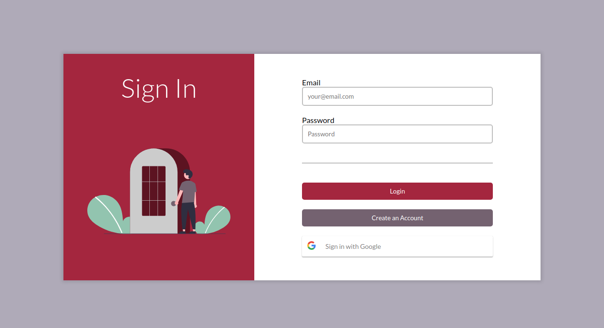
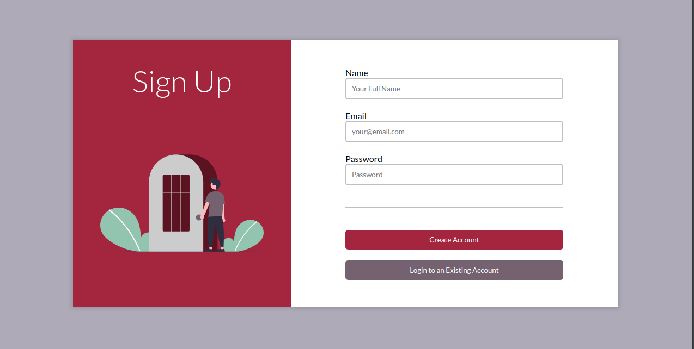

# Authentication

An Authentication boilerplate for `NextJS` + `Apollo GraphQL` + `Prisma ORM` projects.

> The session is managed by `HTTP-only Auth Cookies`, set by the back-end

> `Google OAuth` is available

> Design based on Google's Material UI, using server-side rendered `Styled Components`




## PostgreSQL Setup

Installation and Setup:

```sh
    # Install postgres and utils.
    sudo apt install postgresql postgresql-contrib

    # Edit the config file:
    sudo nano /etc/postgresql/12/main/pg_hba.conf
    # Change the socket connection auth method to 'md5':
    # # TYPE    DATABASE   USER   ADDRESS   METHOD
    #   local   all        all              md5

    # Restart the PostgreSQL server.
    sudo service postgresql restart
```

Creating an user and database:

```sh
    # Access the PostgreSQL default user.
    sudo -i -u postgres

    # Create a database
    createdb <database_name>

    # Create a user
    createuser --interactive

    Enter name of role to add: <username>
    Shall the new role be a superuser? (y/n) n
    Shall the new role be allowed to create databases? (y/n) n
    Shall the new role be allowed to create more new roles? (y/n) n

    # Change the user password
    \password <username>

    # Access the database.
    psql -d <database_name> -U <username> -W
```

## Prisma Setup

For Prisma to be able to connect to the database, create the `.env` file:

```sh
    # .env

    DATABASE_URL="postgresql://<username>:<password>@localhost:5432/<database_name>"
```

To create (or update) the required tables, run `npx prisma db push --preview-feature`

To visualize the database, run `npx prisma studio`

> Every time the `prisma/schema.prisma` file gets updated, the prisma client must be updated using
> `npx prisma generate`

## Google OAuth Setup

The first step is to create a project on [Google Console](http://console.developers.google.com/)

1. Select `CREATE PROJECT` and choose a name to the project.
2. Select `OAuth consent screen` on the Side Menu and fill the required fields.
   > Add at least the `userinfo.email` and `userinfo.profile` scopes.
3. Select `Credentials` on the Side Menu, click on `CREATE CREDENTIALS` and `OAuth client ID`
4. Choose `Web application`, any name and add an `Authorized JavaScript origin`
5. Copy `Your Client ID` and add it to your `.env.local` file:

```sh
    # .env.local

    JWT_SECRET = "<JWT_SECRET>"
    NEXT_PUBLIC_GOOGLE_OAUTH_CLIENT_ID = "<YOUR_CLIENT_ID>"
```

> On the same `.env.local` file, add a random JWT Secret.

## Run the project

After setting everything up, the only task left is to run the project. You can do so on development or production mode:

```sh
# development
yarn dev

# production
yarn build
yarn start
```
